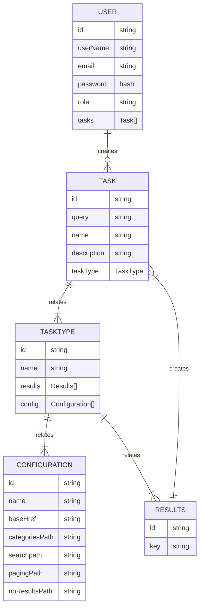

# WaspScraper

### Todo:
    - Scraper results could have automattic paging crawling, look for no of results on search

    - Add entity for scrape results

    -

```mermaid
erDiagram
    USER ||--o{ TASK : creates
    USER {
        id          string
        userName    string
        email       string
        password    hash
        role        string
        tasks       Task[]
    }
    TASK ||--|{ TASKTYPE : relates

    TASK {
        id string
        query string
        name string
        description string
        taskType TaskType
    }
    TASKTYPE ||--|{ CONFIGURATION : relates
    TASKTYPE ||--|{ RESULTS : relates

    TASKTYPE {
        id string
        name string
        results Results[]
        config Configuration[]
    }

    RESULTS ||--|{ TASK : creates
    RESULTS {
        id string
        key string
    }

    CONFIGURATION {
        id string
        name string
        baseHref string
        categoriesPath string
        searchpath string
        pagingPath string
        noResultsPath string
    }

```

